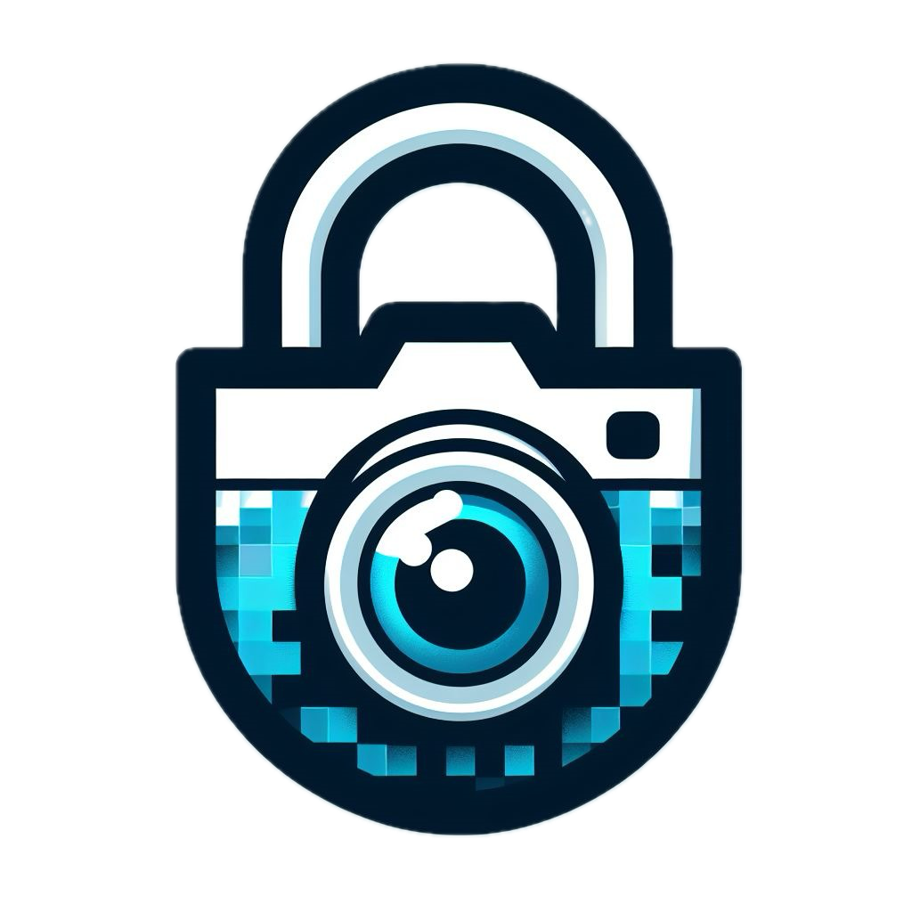

# PixelSafe 🔐
Aplicación de encriptación y recuperación de imágenes y marcas de agua para el curso de *Criptografía*.

Modalidades:
- Marca de Agua (WaterMark)
- Expansión de Píxeles (Pixel Expansion)

**Autores**
- Natalia Monroy Rosas
- David García Pardo
- Estevan Garcia Niño
- Diego Morales Granados

<div align="center">
    
</div>

## Built With 🛠️

* [Python](https://www.python.org/)
* [PyQt5](https://pypi.org/project/PyQt5/)

<!-- GETTING STARTED -->
## Deployment 🚀
Para instalar PixelSafe:

### 1. Clone el repositorio
```
git clone https://github.com/namonroyr/Visual_Cryptography.git
```

### 2. Crear ambiente virtual
```
python -m venv pixelsafe
```

### 3. Activar ambiente virtual
```
Linux:
source pixelsafe/bin/activate
Windows:
pixelsafe\Scripts\activate
```

### 4. Instalar dependencias
```
python -m pip install -r requirements.txt
```

### 5. Ejecutar PixelSafe
```
python main.py
```

---

Universidad Nacional de Colombia.
Departamento de Matemáticas 
2024
